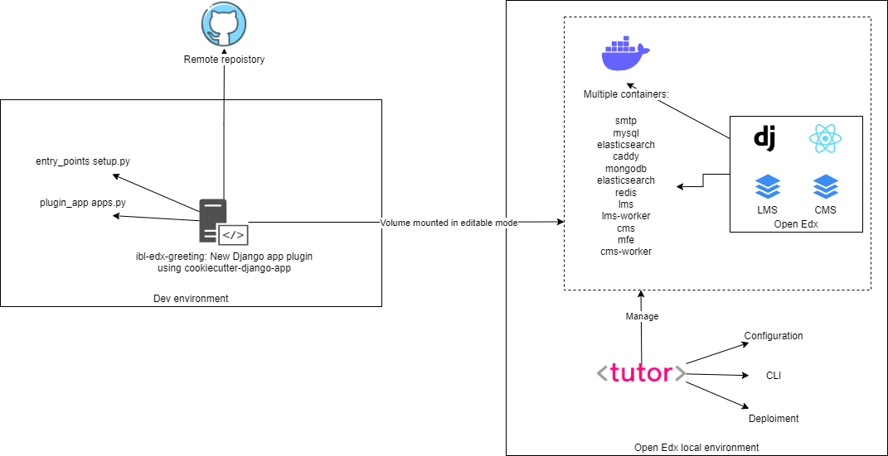

ibl-edx-greeting
#############################

|ci-badge| |codecov-badge| |doc-badge| |pyversions-badge| |license-badge| |status-badge|

Purpose
*******

REST API greeting endpoint

The django app project include a REST API POST endpoint which accept a greeting message from the user.

This endpoint should do the following things with the user-submitted greeting:
    - Log it in the LMS platform.
    - Save it in the database.
    - If the greeting is “hello”, then the view of this API endpoint should call the original greeting endpoint again with “goodbye” as the parameter.

It is secured with Oauth2.

Getting Started
***************

Usage
==========
.. code-block::

  # Get token
  curl -X POST -d "client_id=<client_id>&client_secret=<client_secret>&grant_type=client_credentials&token_type=jwt" http://<URL>/oauth2/access_token/

  # Greeting REST API
  curl -X POST http://<URL>/ibledxgreeting/api/v0/greeting/ -H "Authorization: JWT <token>" -d '{"message": "hello"}'

Documentation
*************

The big picture
===============

References
==========

- Setup:

https://docs.tutor.overhang.io/index.html
https://github.com/openedx/edx-platform/blob/master/docs/guides/extension_points.rst
https://github.com/openedx/edx-platform/tree/master/openedx/core/djangoapps/plugins
https://github.com/openedx/edx-cookiecutters/tree/master/cookiecutter-django-app
https://openedx.atlassian.net/wiki/spaces/AC/pages/3344924689/Using+Tutor+for+local+development#Working-with-edx-platform-Plugins

- Coding:

https://github.com/openedx/edx-django-utils/blob/master/edx_django_utils/plugins/README.rst
https://blog.lawrencemcdaniel.com/getting-started-with-open-edx-plugin-architecture/

- Authentication and Rest API best practices:

https://docs.openedx.org/projects/openedx-proposals/en/latest/best-practices/oep-0049-django-app-patterns.html?highlight=plugin#rest-api
https://openedx.atlassian.net/wiki/spaces/AC/pages/18350757/edX+REST+API+Conventions?NO_SSR=1#11.-Authentication
https://docs.openedx.org/projects/openedx-proposals/en/latest/best-practices/oep-0042-bp-authentication.html?highlight=rest%20api#oauth2-and-jwts
https://github.com/openedx/edx-platform/tree/master/openedx/core/djangoapps/oauth_dispatch
https://github.com/openedx/edx-drf-extensions/blob/master/edx_rest_framework_extensions/auth/jwt/README.rst
https://github.com/openedx/edx-platform/blob/master/openedx/core/djangoapps/oauth_dispatch/docs/decisions/0003-use-jwt-as-oauth-tokens-remove-openid-connect.rst
https://github.com/openedx/edx-rest-api-client

License
*******

The code in this repository is licensed under the AGPL 3.0 unless
otherwise noted.

Please see `LICENSE.txt <LICENSE.txt>`_ for details.

.. |ci-badge| image:: https://github.com/openedx/ibl-edx-greeting/workflows/Python%20CI/badge.svg?branch=main
    :target: https://github.com/openedx/ibl-edx-greeting/actions
    :alt: CI

.. |codecov-badge| image:: https://codecov.io/github/openedx/ibl-edx-greeting/coverage.svg?branch=main
    :target: https://codecov.io/github/openedx/ibl-edx-greeting?branch=main
    :alt: Codecov

.. |doc-badge| image:: https://readthedocs.org/projects/ibl-edx-greeting/badge/?version=latest
    :target: https://ibl-edx-greeting.readthedocs.io/en/latest/
    :alt: Documentation

.. |pyversions-badge| image:: https://img.shields.io/pypi/pyversions/ibl-edx-greeting.svg
    :target: https://pypi.python.org/pypi/ibl-edx-greeting/
    :alt: Supported Python versions

.. |license-badge| image:: https://img.shields.io/github/license/openedx/ibl-edx-greeting.svg
    :target: https://github.com/openedx/ibl-edx-greeting/blob/main/LICENSE.txt
    :alt: License

.. |status-badge| image:: https://img.shields.io/badge/Status-Experimental-yellow